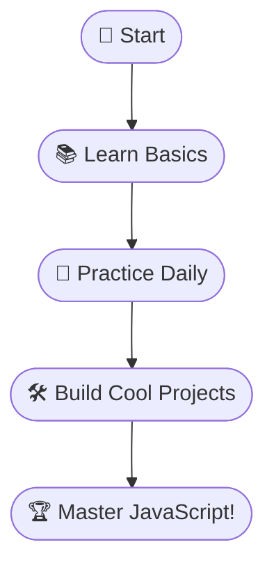

# Learning JavaScript 
## 🚀 Embarking on My JavaScript Adventure!

Hey there, fellow coder! 👋  
Welcome to my **JavaScript Odyssey**—where every day is a new step toward mastering the language of the web. Whether you're a beginner or just curious, join me as I break down concepts, share code, and sprinkle in some fun! 🌟

---

### 📆 My Daily Coding Quest

| 🌞 Day | 🧩 Topic                | ✍️ What I Learned                |
|-------:|:-----------------------|:---------------------------------|
|   1    | 🚦 Introduction        | What is JavaScript & why use it? |
|   2    | 🏷️ Variables & Types   | Declaring and using variables    |
|   3    | 🔧 Functions           | Writing and calling functions    |
|  ...   | ...                    | ...                              |

---

### 🤔 Why JavaScript? (And Why Now?)

- 🌍 **Runs everywhere:** From browsers to servers!
- 🛠️ **Easy to start:** Friendly for beginners.
- 🎨 **Creative freedom:** Build games, apps, and more.
- 💼 **In-demand skill:** Opens doors in tech.

---

### 🗺️ My Learning Map



---

### 💡 Code of the Day

```javascript
// Day 1: My First JavaScript Output!
console.log("Hello, JavaScript World! 🌍✨");
```

---

### 🎯 What You'll Find Here

- 🧑‍💻 **Daily bite-sized code & tips**
- 📝 **Simple, clear explanations**
- 🗺️ **Visual guides & flowcharts**
- 🤓 **Fun facts & motivation**
- 🔄 **Consistent, real progress**

---

Ready to code, learn, and have fun?  
**Follow along, share your thoughts, and let's grow together!** 🚀💬

Stay tuned for daily updates—your JavaScript journey starts here! 🌱✨
